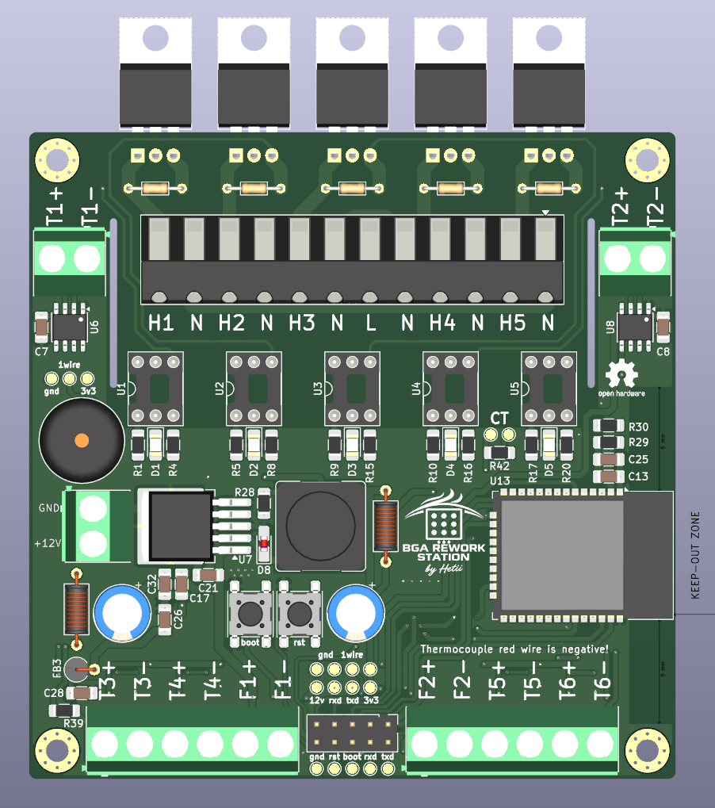
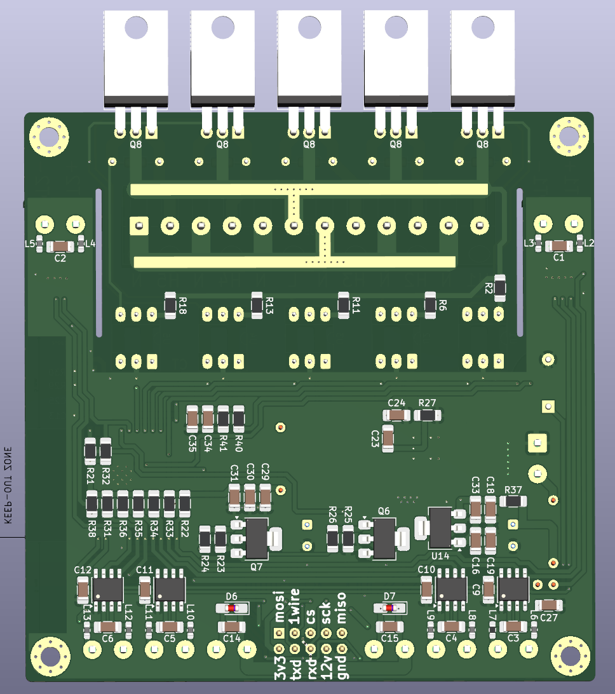

# BGA REWORK STATION
Advanced Open-Source BGA Preheater Controller with Web Interface, Multi-Zone Heating, and Thermal Profile Management.
<p align="left">
  
  
</p>

---

## 📖 Overview

**BGA Rework Station** is a fully open-source project designed for controlling professional and DIY BGA/PCB preheating systems.

The controller supports multiple heating zones, thermocouple monitoring, fan control, and a modern web-based interface for managing the entire process directly from a browser.

The project is suitable for:
- BGA rework stations
- PCB preheaters
- SMT/reflow experiments
- Electronics repair workshops
- DIY thermal control systems

---

# ✨ Features

## 🔥 Multi-Zone Heater Control
- Control up to **5 independent heaters**
- Separate heating zones
- Real-time power management
- Suitable for IR heaters, ceramic heaters, hotplates, and custom heating systems

## 🌡️ Thermocouple Monitoring
- Support for **6 thermocouples** and ds18b20 sensors over 1 wire
- Real-time temperature acquisition
- Multi-point PCB temperature tracking
- Accurate thermal feedback for safe BGA processing

## 🌀 Fan Control
- PWM fan control support
- Automatic or manual cooling operation
- Active thermal stabilization

## 🌐 Web Interface
Built-in web application accessible from any browser.

Features include:
- Real-time temperature monitoring
- Heater control
- Fan management
- Profile editor
- System status monitoring
- Live thermal charts

## 💾 BGA Profile Management
- Save and load BGA heating profiles
- Custom temperature curves
- Repeatable rework processes
- Profile storage directly in the system

---

# 🛠️ Hardware Capabilities

| Feature | Specification |
|---|---|
| Heater Outputs | Up to 5 |
| Thermocouple Inputs | 6 |
| Fan Control | 2 x PWM Supported |
| Interface | Web Browser |
| Profile Storage | Supported |
| Open Source | Yes |

---

# 📂 Project Structure

```text
/
├── hardware
│   ├── grb
│   ├── img
│   ├── kicad
│   └── pdf
├── README.md
└── software
    ├── builder
    ├── builder.py
    ├── configs
    ├── html
    ├── include
    ├── requirements.txt
    └── src
```
